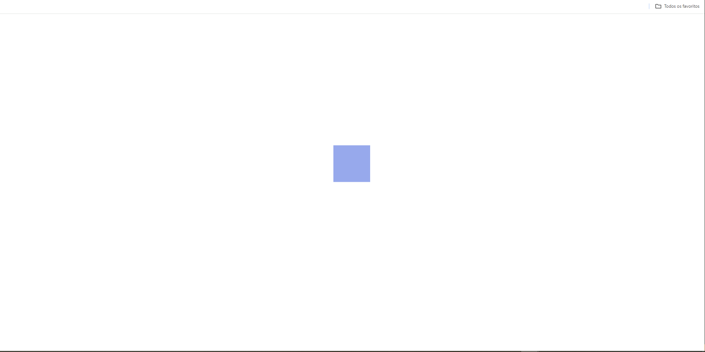

# Essa pagina é aonde eu coloco minhas competencias de Animação com Javascript

 => alguns projetos que tenho orgulho de fazer é o BigBang animado quando eu clico e explode varias estrelas pelo universo.

 => Esse projeto tenho orgulho de ter feito ele porque é aonde eu aprendi a utilizar o KeyframeEffect, DocumentTimeline, Animation essas 3 classes
 Nativas do Javascript para trabalhar com isso. Muito Legal!!

